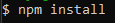
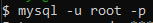
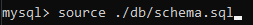
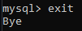
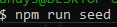

# backend-for-ecommercestore

## Description

This application is a backend for an ecommmerce store. It tracks ecommerce features like categories, products and tags. While allowing users to add, delete or update items in these features.
The technologies used to make this application were

- node.js
- mysql
- sequilize
- mysql2
- dotenv
- express
- Insomnia

The most challenging part of this application was connecting the relationships in the relational database using sequilize.

## Installation

To install this application you will have to go to the github repository for this project which can be found https://github.com/Andysu7117/backend-for-ecommercestore and download it locally onto your desktop. This application was made using node.js v16.20.1, mysql and insomnia so in order to run the application you will have to have these installed. The links can be found here:

- https://nodejs.org/en/blog/release/v16.20.1
- https://insomnia.rest/pricing
- https://dev.mysql.com/downloads/installer/

  Once all these have been installed you will have to enter into the directory of the application and enter npm install  into the command line to install all the dependencies. Once all the dependencies have been installed you will have to create a .env file in the directory that matches the layout of the dotenvexample file in the directory.

## Usage

Once everything has been installed you can use this application by sourcing the database from the db folder using the following my sql commands of mysql -u root -p, then enter your mysql password and then sourcing the database by using source ./db/schema.sql:

- 
- 

You can exit the sql command line by typing in exit . After the database has been installed you will have to seed the data by running npm run seed in command line .

Then the application can be started by running npm start in the command line. . Once the application has been started the user can go to insomnia to use all the get, post, delete and put requests for the routes in the application. The following video shows how this application should work:

- https://youtu.be/PDMvMoYxx6E
